Azure Media Services xBlock
===========================

This xBlock allows for the inclusion of videos that are hosted on Azure Media Services inside of Open edX courses. The primary features of this xBlock are:

* (optionally) protected videos that only students enrolled in a course can watch the video. This contrasts with the standard Open edX video player which does not offer any protection from non-enrolled students to watch the video

* subtitles/captions via WebVTT standards

* interactive transcripts

This xBlock is still at an experimental stage and is still under development.

Code of Conduct
---------------
This project has adopted the [Microsoft Open Source Code of Conduct](https://opensource.microsoft.com/codeofconduct/). For more information see the [Code of Conduct FAQ](https://opensource.microsoft.com/codeofconduct/faq/) or contact [opencode@microsoft.com](mailto:opencode@microsoft.com) with any additional questions or comments.

Installation
------------

To install the Azure Media Services XBlock within your edX Python environment, run the following command (for fullstack):

```bash
$ sudo -u edxapp bash
$ source /edx/app/edxapp/edxapp_env
$ pip install /path/to/xblock-azure-media-services/
```

or for devstack:

```bash
$ sudo su edxapp
$ pip install /path/to/xblock-azure-media-services/
```


Enabling in Studio
------------------

To enable the Azure Media Services XBlock within studio:

1. Navigate to `Settings -> Advanced Settings` from the top nav bar.
2. Add `"azure_media_services"` to the Advanced Module List, as shown in the screen shot below.

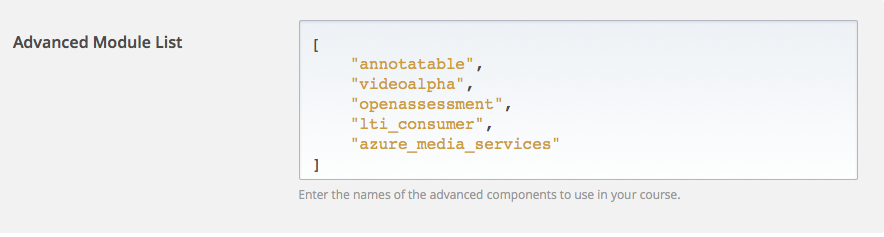


Usage
-----

After the Azure Media Services xBlock is enabled, when the Studio user is inside of a Unit, when he/she clicks on the Advanced button (displayed below all existing components inside of a Unit), the “Azure Media Services Video Player” will appear in the list. Such as:


Clicking that xBlock will populate, the Unit with a functional - but unconfigured - Azure Media Player:

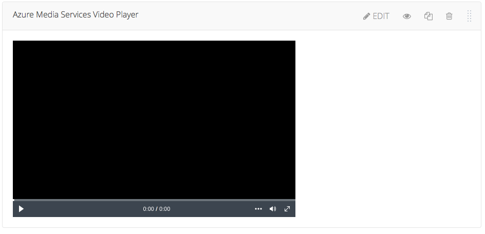

Click the Edit button in the upper right corner to expose the scrollable setting panel for the xBlock:

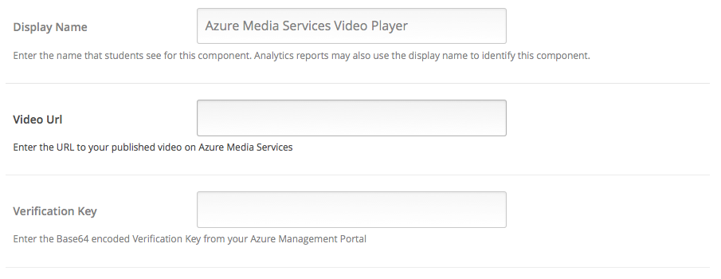
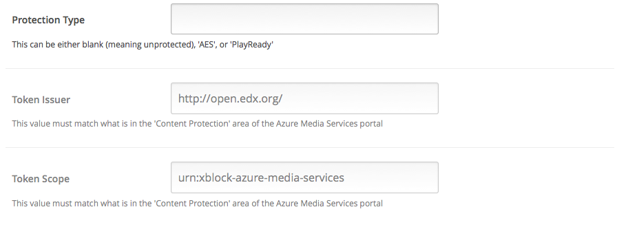
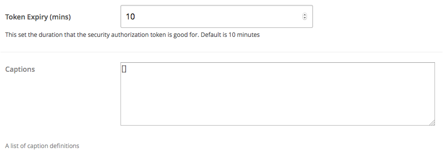

The following is a description of the fields and how to configure them. At a minimum, the courseware author will need to fill in the Video Url to match what Azure Media Services portal says the Publish URL is, for example (old Azure dashboard):

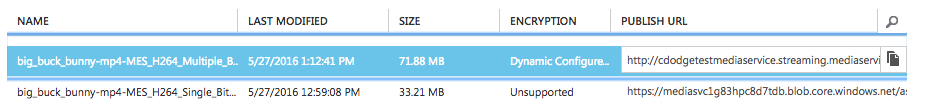

Or in the new Azure dashboard:

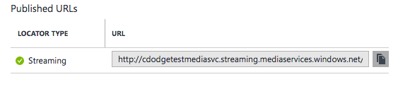

In order to avoid mixing HTTP/HTTPS which can cause some warnings to appear in some browsers, it is recommended that you simply drop the http: or https: and simply start at the double slashes: e.g. ‘//cdodgetestmediaservice.streaming.mediaservices.windows.net/7aaeec64-aa78-436b-bd43-68ae72bb3b4d/big_buck_bunny.ism/Manifest'

At this point, if the video you want to include does not utilize Video Protection, then you can simply Save and Close the Setting dialog box. Then the page should refresh and you should see the video be loaded (but not auto-play).

If the video DOES use Protection, then if you just specify the Video URL but fail to specify the protection related properties (or have them incorrectly configured), then you will see something like:

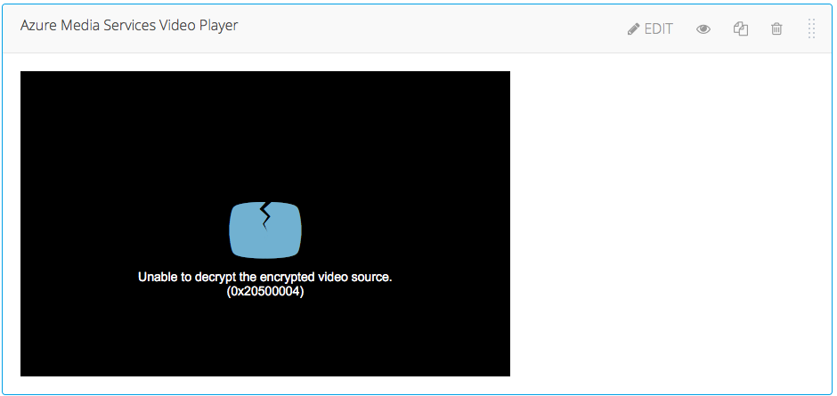

If you wish to use Azure Media Service’s Video Protection features, then you will need to have your Azure dashboard set up in a particular manner. For example (old Azure dashboard):

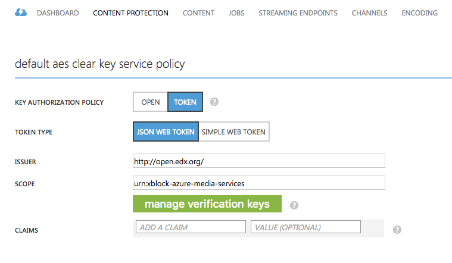

In the new Azure dashboard, the Content Protection area looks different, but is basically the same concept:

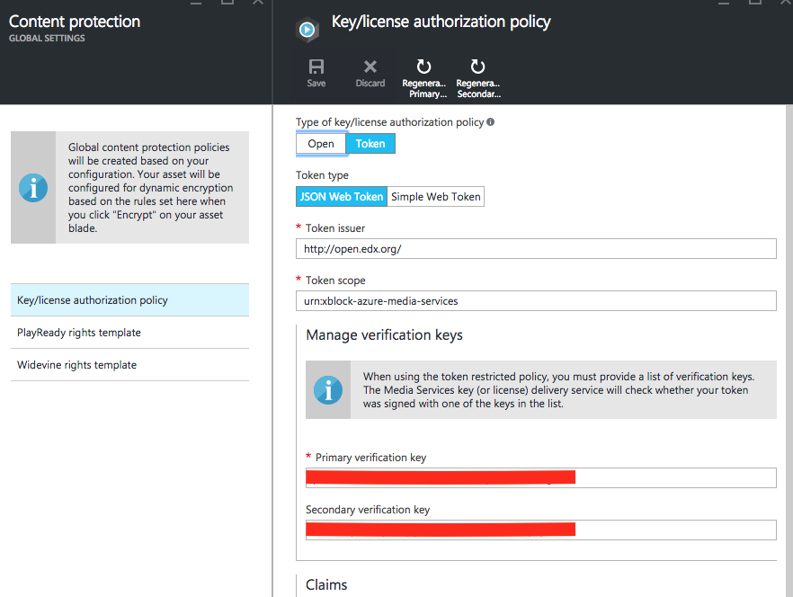

At this point in time, the Azure Media Services xBlock only can generate “JSON Web Tokens”, so that must be selected. Then for the Issuer and Scope fields, it is very important that you EITHER a) use the defaults that are in the xBlock OR b) reconcile the values between the Azure portal and the xBlock setting dialog AS THEY MUST MATCH EXACTLY. The defaults for the xBlock are shown in the above screenshot (‘http://open.edx.org’ and ‘urn:xblock-azure-media-services’, respectively). There are no semantic meaning behind these two defaults.

Also, for the older version of Azure Media Services dashboard, users will need to generate and copy over the Verification Keys from the portal to the xBlock:

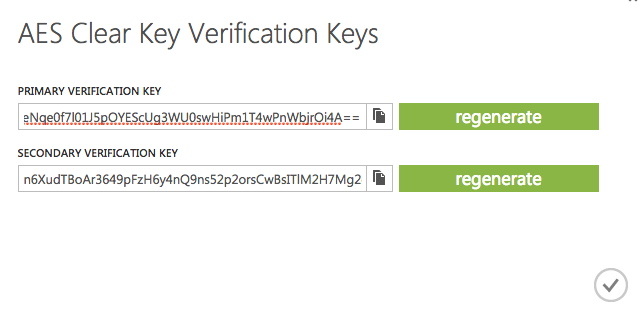

In the newer Azure dashboard/portal, the Regenerate Keys button has moved to the top of the pane:

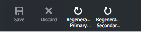

Or, as an option, you can create your own AES encryption keys, but note that they must be base64 encoded:

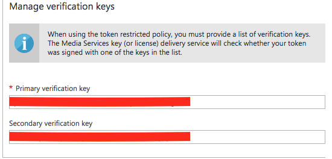

If you’d prefer to generate keys on a local machine, then - for example on OSx - you can:

```
dd bs=1 count=32 if=/dev/urandom | openssl base64
This will output something like:
32+0 records in
32+0 records out
32 bytes transferred in 0.000059 secs (543392 bytes/sec)
vBjBqVqioLb6q3ayVWpkuGOn4i3xKitKkZpH/FSF1Yg=
```

The last line at the bottom is a valid Base64 encoded AES encryption key. Just copy that into your cut/paste buffer and put into the Azure “Manage verification keys” portion of the portal.

Then, regardless of how you generate these keys, simply copy one of the keys - typically the primary - into the clipboard and then paste it into the xBlock settings pane:

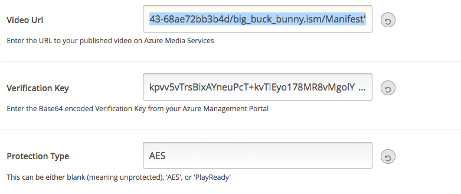

IMPORTANT: The courseware author also needs to specify the “Protection Type” in this case to match which Protection is being utilized - in this case AES.

If all is configured correctly - i.e. the verification key, protection type, the token issuer, and token scope - then after saving these changes the video should properly play back.

IMPORTANT: I have noticed some latency for some configuration changes in Azure Media Services to take effect. If protected video playback doesn’t work, wait a few minutes and refresh the page. If it still doesn’t work, carefully inspect all of the values and make sure they match between the Azure portal and the xBlock settings

Working with Transcripts/Subtitles/Captions
-----------------------------------------

This version of the Azure Media Services xBlock supports several means to associate text (i.e. dialog) with a video. All text associations with videos uses the WebVTT standard: https://w3c.github.io/webvtt/

**_Subtitles/Captions_**: These are short pieces of text which are rendered in the lowest center portion of the video player, in a manner similar to captions on a television. The Azure Media Player supports subtitles and captions out of the box, and the Azure Media Services xBlock merely wires through the existing support.

While subtitles/captions are rendered in the same manner, they are typically targeted to different audiences. Subtitles are typically for translations between languages, but captions are for users who have accessibility needs.

To use subtitles/captions, simply fill in the Captions field inside the xBlock settings panel. Right now the UI is a text field in which the content editor will have to input in a JSON formatted array of dictionaries. This will change into a more user-friendly UI in a subsequent version of the xBlock:

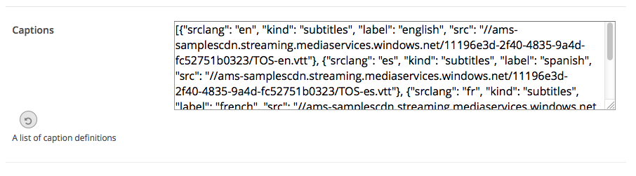

As a better illustration of the data payload, here is a sample:

```
[{
"srclang": "en",
"kind": "subtitles",
"label": "english",
"src":"//ams-samplescdn.streaming.mediaservices.windows.net/11196e3d-2f40-4835-9a4d-fc52751b0323/TOS-en.vtt"}
,{
"srclang": "es",
"kind": "subtitles",
"label": "spanish",
"src":"//ams-samplescdn.streaming.mediaservices.windows.net/11196e3d-2f40-4835-9a4d-fc52751b0323/TOS-es.vtt"}
,{
"srclang": "fr",
"kind": "subtitles",
"label": "french",
"src":"//ams-samplescdn.streaming.mediaservices.windows.net/11196e3d-2f40-4835-9a4d-fc52751b0323/TOS-fr.vtt"}
,{
"srclang": "it",
"kind": "subtitles",
"label": "italian",
"src":"//ams-samplescdn.streaming.mediaservices.windows.net/11196e3d-2f40-4835-9a4d-fc52751b0323/TOS-it.vtt"
}]
```

The kind field can either be _‘subtitles’_ or _‘captions’_. The srclang field is an ISO short declaration of the language that the text is in. The label field is what is displayed in the select menu in the player. And src is a URL where the VTT file can be sourced from.

When everything is configured, the player should look like something like:

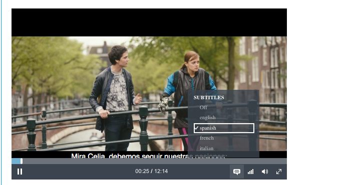

**_Transcripts_**

Transcripts are very similar to captions/subtitles, but it is designed more for display of larger amounts of text associated with a video. The WebVTT text is displayed in a large, scrollable pane to the side of the video player region. Furthermore, as the video is played, the current portion of the audio track is highlighted in the text region. As the video progresses, the user can visually see what area of the transcript is current. In addition, the transcript acts as a “seek” mechanism. If a user clicks on an area of the transcript, the video jumps to the portion of the video that correlates to that piece of text. 

Transcript features are part of Open edX and the implementation in the Azure Media Services xBlocks is meant to be a “feature parity” compared to the out-of-the-box video player support in Open edX.

To use transcripts in the Azure Media Services xBlock, in the settings dialog:

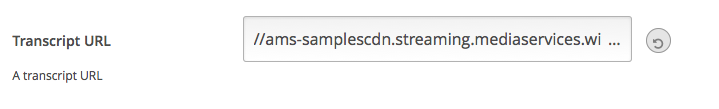

This UI will likely change in a future version of the xBlock. The URL should point to a WebVTT file in a similar manner to the subtitles/captions.

If configured correctly, the entire WebVTT file will be read and presented in the scrolling region to the right of the video player. When the video plays, you will notice that the current text associated with the video track will be highlighted. You will see something like:

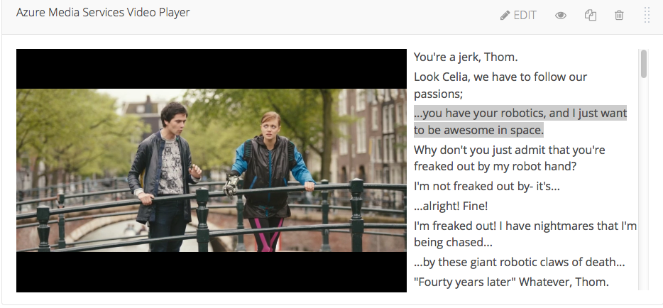

The viewer can click on any piece of the transcript text and the video player will seek to the time associated to that portion of the clicked transcript.


Analytic Events
---------------

This Azure Media Services xBlock produces analytics events. We have decided to use the existing video player events/schemas so that it will be compatible with existing video engagement analytics tools as defined at http://edx.readthedocs.io/projects/devdata/en/latest/internal_data_formats/tracking_logs.html#video

The following events are currently emitted from the Azure Media Services xBlock into the analytics stream:

```
edx.video.loaded
edx.video.played
edx.video.paused
edx.video.position.changed
edx.video.stopped
```

The next iteration of this player will include the following analytic events.

```
edx.video.transcript.hidden
edx.video.transcript.shown
edx.video.closed_captions.hidden
edx.video.closed_captions.shown
speed_change_video
edx.video.language_menu.hidden
edx.video.language_menu.shown
```

